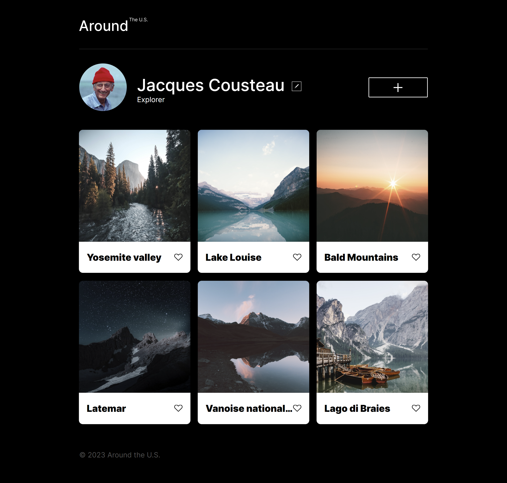
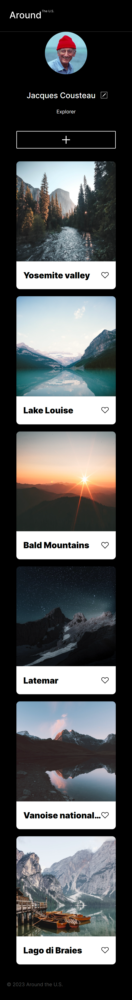

# Project 3: Around The U.S.

### Overview

- Intro
- Figma
- Images

**Intro**

This project is made so all the elements are displayed correctly on popular screen sizes. We recommend investing more time in completing this project, since it's more difficult than previous ones.

**Figma**

- [Link to the project on Figma](https://www.figma.com/file/ii4xxsJ0ghevUOcssTlHZv/Sprint-3%3A-Around-the-US?node-id=0%3A1)

**Images**

The way you'll do this at work is by exporting images directly from Figma — we recommend doing that to practice more. Don't forget to optimize them [here](https://tinypng.com/), so your project loads faster.

Good luck and have fun!

Around The U.S. project is a profile page which includes profile picture, name, and profession. Also it includes edit and add buttons which are theoretically could start working in future by adding new code and functionality. And finally 6 pictures in gallery with description and the like button.
Grid and flex layouts has been used while was working on this page, buttons has ability to transition when they're hovered. And the page itself adapts on diffferent page sizes (desktop, tablet, mobile).

Desktop 
Mobile 
Link to github (https://aydar013.github.io/se_project_aroundtheus/)
